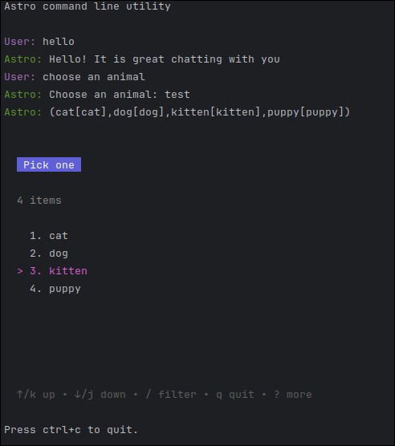

# Virtual Assistant CLI

Simple CLI for [Virtual Assistant](https://github.com/redHatInsights/astro-virtual-assistant-v2) built with golang using [bubbletea](https://github.com/charmbracelet/bubbletea).

This CLI was started to have an easy-to-use alternative for testing Virtual Assistant without having to run the full setup or use the REST API directly.

## Running 

Use `make run` to start the CLI. It does not support everything!

Supports:
 - Sending text, selection options
 - Receiving text, options, pause and commands.
 - Display pause as "<pause>" 
 - Commands are displayed as "/command" - it does not show the arguments.
